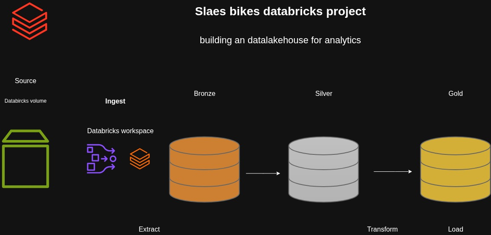
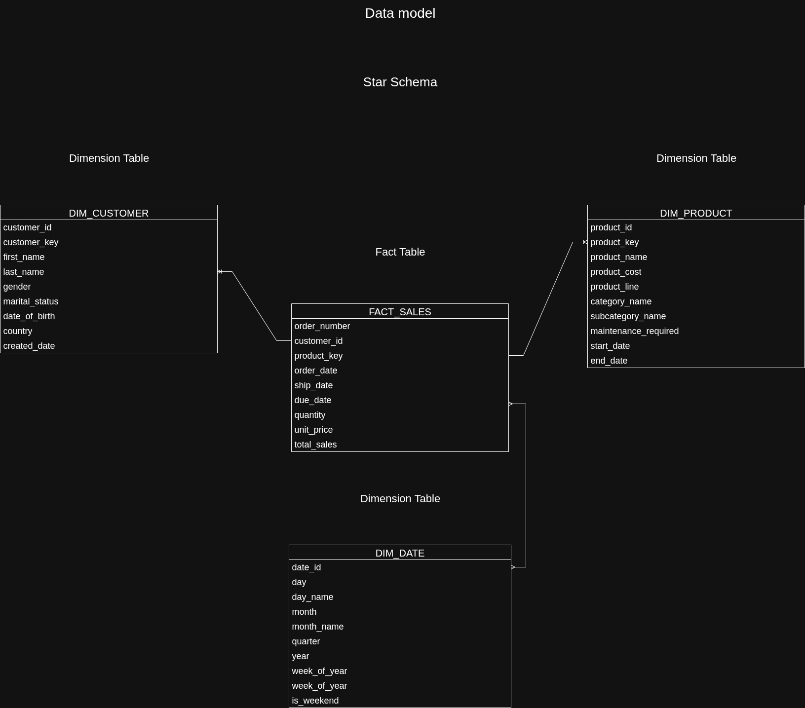

# Databricks Bootcamp Project – Data with Baraa

🚀 This repository contains a **hands-on data engineering project** inspired by the **Databricks Bootcamp** by *Data with Baraa*.  
It demonstrates how to build scalable data pipelines using **Apache Spark**, **Databricks**, and modern data engineering best practices.

---

## 📝 Project Overview

This project walks through the full lifecycle of a data engineering workflow, including:

- Ingesting raw data into Databricks  
- Cleaning, transforming, and enriching datasets using **PySpark** and **Spark SQL**  
- Building analytical datasets for downstream reporting  
- Applying real-world data engineering concepts taught in the bootcamp  

The goal is to provide a practical, end‑to‑end example of how data engineering is done in modern cloud environments.

---

## ⚡ Features

- **Data Ingestion**  
  Load datasets from CSV and other sources into Databricks

- **Data Transformation**  
  Clean, normalize, deduplicate, and enrich data using PySpark and SQL

- **Data Analytics**  
  Build aggregated tables and summary insights

- **Databricks Integration**  
  Fully implemented notebooks with Spark 4.0.0 runtime

---

## 🛠 Tech Stack

- Apache Spark (PySpark)  
- Databricks  
- Python  
- SQL  
- Delta Lake (optional if used)

---

├── code/  
│ ├── bronze/  
│ │ └── bronze.ipynb # Raw data ingestion from source systems  
│ ├── silver/  
│ │ ├── crm_cust_info_silver.ipynb # CRM customer data cleansing  
│ │ ├── crm_prd_info_silver.ipynb # CRM product data standardization  
│ │ ├── crm_sales_details_silver.ipynb # CRM sales transaction cleaning  
│ │ ├── erp_cust_az12_silver.ipynb # ERP customer data harmonization  
│ │ ├── erp_loc_a101_silver.ipynb # ERP location data enrichment  
│ │ └── erp_px_cat_g1v2_silver.ipynb # ERP product category mapping  
│ └── gold/   
│ ├── gold_dim_customer.ipynb # Conformed customer dimension   
│ ├── gold_dim_date.ipynb # Date dimension (calendar/fiscal)  
│ ├── gold_dim_product.ipynb # Conformed product dimension  
│ └── gold_fact_sales.ipynb # Sales fact table (star schema)   
│
├── images/   
│ ├── data_architecture_diagram.jpg # ETL pipeline flow diagram  
│ └── data_model_diagram.jpg # Star schema data model  
│
├── LICENSE # Project license  
└── README.md # Project documentation   

---

## 🏗 Data Architecture Diagram

---

## 📊 Data Model Diagram

---

## ▶️ How to Run the Project

1. Import the notebooks into Databricks  
2. Upload the raw dataset into Databricks
3. Run the ingestion notebook  
4. Run the transformation notebook  
5. Run the analytics notebook  
6. View results in tables or dashboards  

---

## 🚀 Future Enhancements

- Add Delta Live Tables  
- Add CI/CD with Databricks Repos  
- Add monitoring & data quality checks (Great Expectations)

---

## 📬 Contact

Created by **Mohamed A.**  
🔗 LinkedIn: [https://www.linkedin.com/in/mohmmed-a-154741125](https://www.linkedin.com/in/mohmmed-a-154741125)